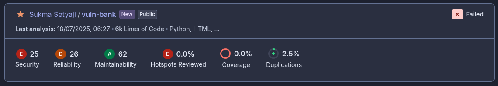

# DevSecOps Pipeline Documentation

Author: Sukma Setyaji

## Project: vuln-bank (https://github.com/Commando-X/vuln-bank)

> Purpose: Automated security scanning and deployment with Discord reporting.

Referenced Repository: (https://github.com/Commando-X/vuln-bank)

Submission Repository: (https://github.com/suksest/vuln-bank)

## Pipeline Overview

| Stage | Technology| Output |
| --- | --- | --- |
| Secret Scanning| TruffleHog| trufflehog.json |
| SCA (Composition Scan)| Syft + Grype| vuln-bank-syft.json, vuln-bank-grype.json |
| SAST (Static Scan) | SonarQube/SonarCloud | sonarqube-results-issues.json |
| Build & Deploy| Docker Compose | Running staging environment |
| DAST (Dynamic Scan)| OWASP ZAP| zap-report.json |
| Discord Notification | Discord Webhook | Security summary message |

## Detailed Stage Breakdown

### Stage 1: Secret Scanning

> Purpose: Detect secrets/credentials in codebase.

Tool: **TruffleHog**

Command:

    trufflehog --no-update git file://. --json | tee trufflehog.json

Output Handling: Archives *trufflehog.json*

Counts findings: number of JSON objects

Example Result:

### Stage 2: Software Composition Analysis (SCA)

> Purpose: Identify vulnerable dependencies.

Tools:

- **Syft**: Generates SBOM (Software Bill of Materials).

- **Grype**: Scans SBOM for vulnerabilities.

Commands:

    syft scan . -o cyclonedx-json > vuln-bank-syft.json
    grype sbom:./vuln-bank-syft.json -o cyclonedx-json > vuln-bank-grype.json

Output Handling: Archives both JSON reports.

Counts vulnerabilities: Total Vulnerabilities = length(.vulnerabilities) in grype.json

Example Result:

### Stage 3: Static Application Security Testing (SAST)

> Purpose: Analyze source code for security flaws.

Tool: **SonarQube**

Steps:

- Run sonar-scanner with project configuration.

- Fetch issues via SonarQube API.

Output Handling: Archives *sonarqube-results-issues.json*.

Counts issues: sastCount = .total in issues.json

Example Result:

### Stage 4: Build & Deploy to Staging

> Purpose: Deploy application for dynamic testing.

Tool: **Docker Compose**

Command:

    docker compose -f docker-compose-ci.yml up -d --build --remove-orphans

### Stage 5: Dynamic Application Security Testing (DAST)

> Purpose: Test running application for runtime vulnerabilities.

Tool: OWASP ZAP

Steps:

- Get application IP: docker inspect vuln-bank-web.

- Run ZAP baseline scan:

        docker run ... zaproxy/zap-stable zap-baseline.py -t http://<IP>:5000 -J zap-report.json

Handle exit codes based on this [zaproxy documentation](https://www.zaproxy.org/docs/docker/baseline-scan/#exit-value):

0: Success → No warnings

1-2: Warnings → Mark build unstable

3+: Error → Fail pipeline

Output Handling:

Archives *zap-report.json*.

Counts alerts: DAST_COUNT = length(.alerts) in zap-report.json

Example Result:

### Post Action: Discord Notification

> Purpose: Report security findings to Discord.

Trigger: After all stages complete.

Format:

    **Security Scan Results**:
    - Secret Scanning: 5 issues found
    - SCA: 12 vulnerabilities found
    - SAST: 8 issues found
    - DAST: 3 alerts found

Example Result:

## Prerequisites

Jenkins Plugins:

- Docker Pipeline
- SonarQube Scanner
- Discord Notifier

## Artifacts

All reports are archived in Jenkins:

- trufflehog.json (Secrets)

- vuln-bank-*.json (SCA)

- sonarqube-results-issues.json (SAST)

- zap-report.json (DAST)

> Note: Full pipeline code available in Jenkinsfile at project root.
